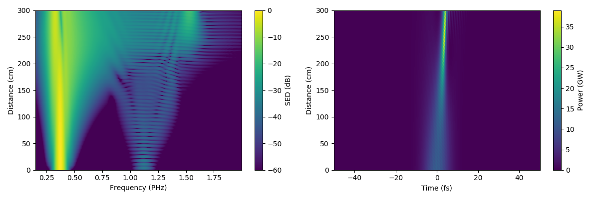
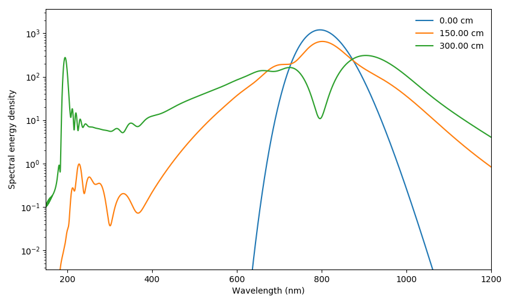
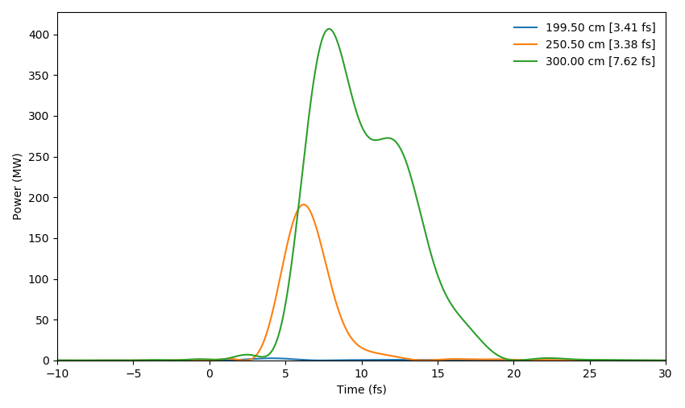
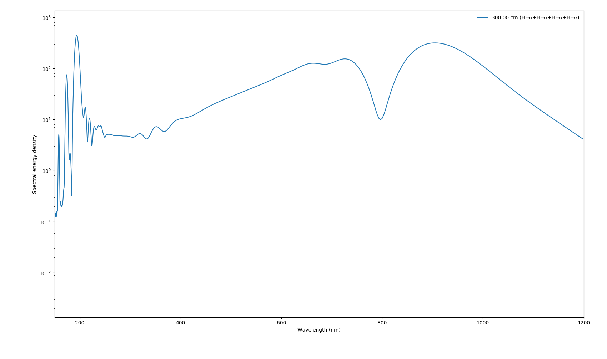

# Luna.jl


[](https://zenodo.org/badge/latestdoi/190623784)
[](https://lupo-lab.com/Luna.jl)


Luna.jl is a flexible platform for the simulation of nonlinear optical dynamics—both in waveguides (such as optical fibres) and free-space geometries—using the unidirectional pulse propagation equation (UPPE). Some of the key features of Luna:
- A variety of propagation geometries treated in a unified way:
    - Single-mode (mode-averaged) propagation in waveguides
    - Multi-mode propagation in waveguides with arbitrary (including non-symmetric) mode-shapes, full polarisation resolution, and intermodal coupling for arbitrary nonlinear polarisation terms
    - Waveguides with arbitrarily varying material properties and cross-sections (e.g. tapered fibres)
    - Free-space propagation with radial symmetry
    - Full (3+1)-dimensional free-space propagation
- Both field-resolved and envelope propagation equations
- A range of linear and nonlinear optical effects:
    - Modal dispersion and loss in waveguides
    - Optical Kerr effect (third-order nonlinearity)
    - Raman scattering in molecular gases
    - Strong-field photoionisation and plasma dynamics
- A built-in interface for the running and processing of multi-dimensional [parameter scans](#running-parameter-scans) in serial or parallel
- A standard library of [plotting](#plotting-results) and [processing](#output-processing) functions, including calculation of spectrograms and beam properties

Luna is designed to be extensible: adding e.g. a new type of waveguide or a new nonlinear effect is straightforward, even without editing the main source code.

Luna was originally developed for modelling ultrafast pulse propagation in gas-filled hollow capillary fibres and hollow-core photonic crystal fibres. Therefore such simulations have particularly good support.

Luna is written in the [Julia programming language](https://julialang.org/), chosen for its unique combination of readability, ease of use, and speed. If you want to use Luna but are new to Julia, see [the relevant section of this README](#new-to-julia).

There are two ways of using Luna:
1. A very simple high-level interface for the most heavily optimised application of Luna—propagation in gas-filled hollow capillary fibres and hollow-core photonic crystal fibres—consisting of the function [`prop_capillary`](#quickstart) and some helper functions to create input pulses.
2. A low-level interface which allows for full control and customisation of the simulation parameters, the use of custom waveguide modes and gas fills (including gas mixtures), and free-space propagation simulations.

For a short introduction on how to use the simple interface, see the [Quickstart](#quickstart) section below. More information, including on the internals of Luna, can be found in the [Documentation](http://lupo-lab.com/Luna.jl).

## Installation
Luna currently only runs with Julia v1.7, which can be obtained from [here](https://julialang.org/downloads/#upcoming_release). Earlier versions lack some required features, and Julia v1.6 triggers an [unresolved bug](https://github.com/LupoLab/Luna/issues/212).

Once Julia is installed, open a new Julia terminal, and install the [CoolProp](https://github.com//CoolProp/CoolProp.jl) Julia package, then Luna:

```julia
]
add https://github.com//CoolProp/CoolProp.jl
add https://github.com/LupoLab/Luna
```
or using `Pkg`

```julia
using Pkg
Pkg.add(PackageSpec(url="https://github.com/CoolProp/CoolProp.jl", rev="master"))
Pkg.add(PackageSpec(url="https://github.com/LupoLab/Luna", rev="master")
```

## Quickstart
To run a simple simulation of ultrafast pulse propagation in a gas-filled hollow capillary fibre, you can use `prop_capillary`. As an example, take a 3-metre length of HCF with 125 μm core radius, filled with 1 bar of helium gas, and driving pulses centred at 800 nm wavelength with 120 μJ of energy and 10 fs duration. We consider a frequency grid which spans from 120 nm to 4 μm and a time window of 1 ps.
```julia
julia> using Luna
julia> output = prop_capillary(125e-6, 3, :He, 1; λ0=800e-9, energy=120e-6, τfwhm=10e-15, λlims=(150e-9, 4e-6), trange=1e-12)
```
The first time you run this code, you will see the precompilation message:
```julia
julia> using Luna
[ Info: Precompiling Luna [30eb0fb0-5147-11e9-3356-d75b018717ce]
```
This will take some time to complete (and you may see additional precompilation messages for the packages Luna depends on), but is only necessary once, unless you update Luna or edit the package source code. Since this is using the default options including FFT planning and caching of the PPT ionisation rate, you will also have to wait for those processes to finish. After the simulation finally runs (which for this example should take between 10 seconds and one minute), you will have the results stored in `output`:
```julia
julia> output = prop_capillary(125e-6, 3, :He, 1; λ0=800e-9, energy=120e-6, τfwhm=10e-15, λlims=(150e-9, 4e-6), trange=1e-12)
[...]
MemoryOutput["simulation_type", "dumps", "meta", "Eω", "grid", "stats", "z"]
```
You can access the results by indexing into `output` like a `Dict`, for example for the frequency-domain field `Eω`:
```julia
julia> output["Eω"]
8193×201 Array{Complex{Float64},2}:
[...]
```
The shape of this array is `(Nω x Nz)` where `Nω` is the number of frequency samples and `Nz` is the number of steps that were saved during the propagation. By default, `prop_capillary` will solve the full-field (carrier-resolved) UPPE. In this case, the numerical Fourier transforms are done using `rfft`, so the number of frequency samples is `(Nt/2 + 1)` with `Nt` the number of samples in the time domain. 

### Multi-mode propagation
`prop_capillary` accepts many keyword arguments (for a full list see the [documentation](http://lupo-lab.com/Luna.jl/dev/interface.html)) to customise the simulation parameters and input pulse. One of the most important is `modes`, which defines whether mode-averaged or multi-mode propagation is used, and which modes are included. By default, `prop_capillary` considers mode-averaged propagation in the fundamental (HE₁₁) mode of the capillary, which is fast and simple but less accurate, especially at high intensity when self-focusing and photoionisation play important roles in the propagation dynamics.

Mode-averaged propagation is activated using `modes=:HE11` (the default) or replacing the `:HE11` with a different mode designation (for mode-averaged propagation in a different mode). To run the same simulation as above with the first four modes (HE₁₁ to HE₁₄) of the capillary, set `modes` to `4` (this example also uses smaller time and frequency windows to make the simulation run a little faster):
```julia
julia> prop_capillary(125e-6, 3, :He, 1; λ0=800e-9, modes=4, energy=120e-6, τfwhm=10e-15, trange=400e-15, λlims=(150e-9, 4e-6))
```
The propagation will take much longer, and the output field `Eω` now has shape `(Nω x Nm x Nz)` with `Nm` the number of modes:
```julia
julia> output_multimode["Eω"]
2049×4×201 Array{Complex{Float64},3}:
[...]
```
**NOTE:** Setting `modes=:HE11` and `modes=1` are **not** equivalent, except if only the Kerr effect is included in the simulation. The former uses mode-averaged propagation (treating all spatial dependence of the nonlinear polarisation the same as the Kerr effect) whereas the latter projects the spatially dependent nonlinear polarisation onto a single mode. This difference is especially important when photoionisation plays a major role.
### Plotting results
More usefully, you can directly plot the propagation results using `Plotting.prop_2D()` (`Plotting` is imported at the same time as `prop_capillary` by the `using Luna` statement):
```julia
julia> Plotting.prop_2D(output)
PyPlot.Figure(PyObject <Figure size 2400x800 with 4 Axes>)
```
This should show a plot like this:

You can also display the power spectrum at the input and output (and anywhere in between):
```julia
julia> Plotting.spec_1D(output, [0, 1.5, 3]; log10=true)
PyPlot.Figure(PyObject <Figure size 1700x1000 with 1 Axes>)
```
which will show this:

`Plotting` functions accept many additional keyword arguments to quickly display relevant information. For example, you can show the bandpass-filtered UV pulse from the simulation using the `bandpass` argument:
```julia
julia> Plotting.time_1D(output, [2, 2.5, 3]; trange=(-10e-15, 30e-15), bandpass=(180e-9, 220e-9))
PyPlot.Figure(PyObject <Figure size 1700x1000 with 1 Axes>)
```


For multi-mode simulations, the plotting functions will display all modes individually by default. You can display the sum over modes instead using `modes=:sum`:
```julia
julia> Plotting.spec_1D(output_multimode; log10=true, modes=:sum)
PyPlot.Figure(PyObject <Figure size 1700x1000 with 1 Axes>)
```

(Compare this to the mode-averaged case above and note the important differences, e.g. the appearance of additional ultraviolet dispersive waves in higher-order modes.)

More plotting functions are available in the [`Plotting`](http://lupo-lab.com/Luna.jl/dev/modules/Plotting.html) module, including for propagation statistics (`Plotting.stats(output)`) and spectrograms (`Plotting.spectrogram()`)

### Output processing
The `Processing` module contains many useful functions for more detailed processing and manual plotting, including:
- Spectral energy density on frequency or wavelength axis with optional spectral resolution setting (`Processing.getEω` and `Processing.getIω`)
- Time-domain fields and pulse envelopes with flexible frequency bandpass and linear (dispersive) propagation operators (`Processing.getEt`)
- Energy (`Processing.energy`) and peak power (`Processing.peakpower`) including after frequency bandpass
- FWHM widths in frequency (`Processing.fwhm_f`) and time (`Processing.fwhm_t`) as well as time-bandwidth product (`Processing.time_bandwidth`)
- g₁₂ coherence between multiple fields (`Processing.coherence`)

## Examples
The [examples folder](examples/) contains complete simulation examples for a variety of scenarios, both for the [simple interface](examples/simple_interface/) and the [low-level interface](examples/low_level_interface). Some of the simple interface examples require the `PyPlot` package to be present, and many of the low-level examples require other packages as well--you can install these by simply typing `] add PyPlot` at the Julia REPL or the equivalent for other packages.

## The low-level interface
At its core, Luna is extremely flexible, and the simple interface using `prop_capillary` only exposes part of what Luna can do. There are lots of examples in the [low-level interface examples folder](examples/low_level_interface). These are not actively maintained and are not guaranteed to run. As a side effect of its flexibility, it is quite easy to make mistakes when using the low-level interface. For example, changing from single-mode to multi-mode propagation in a fibre requires several concurrent changes to your code. If you have trouble with this interface, [open an issue](https://github.com/LupoLab/Luna/issues/new) with as much detail as possible and we will try to help you run it.

## Running parameter scans
Luna comes with a built-in interface which allows for the running of single- and multi-dimensional parameter scans with very little additional code. An example can be found in the [examples folder](examples/simple_interface/scan.jl) and more information is available in the [documentation](http://lupo-lab.com/Luna.jl/dev/scans.html).

## New to Julia?
There are many resources to help you learn Julia. A good place to start is [Julia Academy](https://juliaacademy.com/) which has several courses for learning Julia depending on your current experience. There are additional resources linked from the [Julia website](https://julialang.org/learning/).

To edit and run Julia code, a very good option is the [Julia extension](https://www.julia-vscode.org/) for [Visual Studio Code](https://code.visualstudio.com/).

Julia fully supports [Unicode symbols in code](https://docs.julialang.org/en/v1/manual/variables/), including Greek letters. Luna makes heavy use of this to name variables `ω` instead of `omega`, `π` instead of `pi`, etc. In any Julia console you can enter many Unicode characters using [a backslash and the tab key](https://docs.julialang.org/en/v1/manual/unicode-input/), for example `\omega<tab>` will result in `ω`, and `\ne<tab>` will result in `≠` (and the latter is equivalent to `!=`). For even faster entry of Greek letters specifically, you can use [this AutoHotkey script](https://github.com/q2apro/ahk_greekletters) or a number of other solutions.

## Getting help & contributing
If something does not work as expected, you have found a bug, or you simply want some advice, please [open a new issue](https://github.com/LupoLab/Luna/issues/new) on this GitHub repository. Please do not email us with problems/questions about Luna!

Luna is being actively developed on this GitHub repository. To contribute a bugfix or a new feature, please create a pull request here. If you are new to GitHub, follow any one of the [many](https://github.com/firstcontributions/first-contributions) [useful](https://akrabat.com/the-beginners-guide-to-contributing-to-a-github-project/) [guides](https://codeburst.io/a-step-by-step-guide-to-making-your-first-github-contribution-5302260a2940) around to learn the (very simple!) GitHub workflow. You can also ask John Travers ([@jtravs](https://github.com/jtravs)) or Chris Brahms ([@chrisbrahms](https://github.com/chrisbrahms)) for further help and information.

## Credits
Luna is jointly developed by Chris Brahms ([@chrisbrahms](https://github.com/chrisbrahms)) and John Travers ([@jtravs](https://github.com/jtravs)). Chris started the project and leads the development, while John has made multiple major contributions, and much of Luna is based on John's earlier propagation code.

## Funding
The early development of Luna was supported by funding from the European Research Council (ERC) under the European Union's Horizon 2020 research and innovation program: Starting Grant agreement HISOL, No. 679649.

## References
1. Kolesik, M., Moloney, J.V., 2004. Nonlinear optical pulse propagation simulation: From Maxwell’s to unidirectional equations. Physical Review E - Statistical, Nonlinear, and Soft Matter Physics 70. https://doi.org/10.1103/PhysRevE.70.036604
2. Dormand, J.R., Prince, P.J., 1986. Runge-Kutta triples. Computers & Mathematics with Applications 12, 1007–1017. https://doi.org/10.1016/0898-1221(86)90025-8
3. Dormand, J.R., Prince, P.J., 1980. A family of embedded Runge-Kutta formulae. Journal of Computational and Applied Mathematics 6, 19–26. https://doi.org/10.1016/0771-050X(80)90013-3
4. Hult, J., 2007. A Fourth-Order Runge–Kutta in the Interaction Picture Method for Simulating Supercontinuum Generation in Optical Fibers. Journal of Lightwave Technology 25, 3770–3775. https://doi.org/10.1109/JLT.2007.909373
5. Geissler, M., Tempea, G., Scrinzi, A., Schnürer, M., Krausz, F., Brabec, T., 1999. Light Propagation in Field-Ionizing Media: Extreme Nonlinear Optics. Physical Review Letters 83, 2930–2933. https://doi.org/10.1103/PhysRevLett.83.2930
6. Perelomov, A.M., Popov, V.S., Terent ’ev, M.V., 1966. Ionization of atoms in an alternating electric field. Soviet Physics JETP 23, 1393–1409.
7. Ammosov, M.V., Delone, N.B., Krainov, V.P., 1986. Tunnel Ionization Of Complex Atoms And Atomic Ions In Electromagnetic Field. Soviet Physics JETP 64, 1191–1194. https://doi.org/10.1117/12.938695
8. Börzsönyi, A., Heiner, Z., Kalashnikov, M.P., Kovács, A.P., Osvay, K., 2008. Dispersion measurement of inert gases and gas mixtures at 800 nm. Applied Optics 47, 4856. https://doi.org/10.1364/AO.47.004856
9. Ermolov, A., Mak, K.F., Frosz, M.H., Travers, J.C., Russell, P.S.J., 2015. Supercontinuum generation in the vacuum ultraviolet through dispersive-wave and soliton-plasma interaction in a noble-gas-filled hollow-core photonic crystal fiber. Physical Review A 92, 033821. https://doi.org/10.1103/PhysRevA.92.033821
10. Lehmeier, H.J., Leupacher, W., Penzkofer, A., 1985. Nonresonant third order hyperpolarizability of rare gases and N2 determined by third harmonic generation. Optics Communications 56, 67–72. https://doi.org/10.1016/0030-4018(85)90069-0
